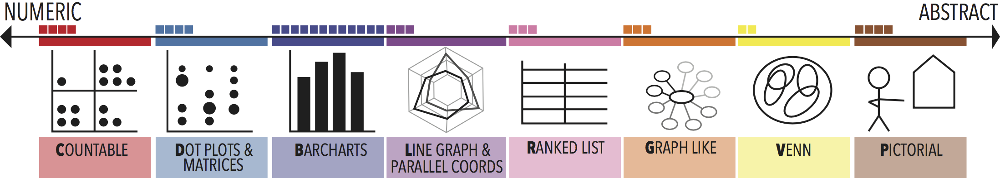
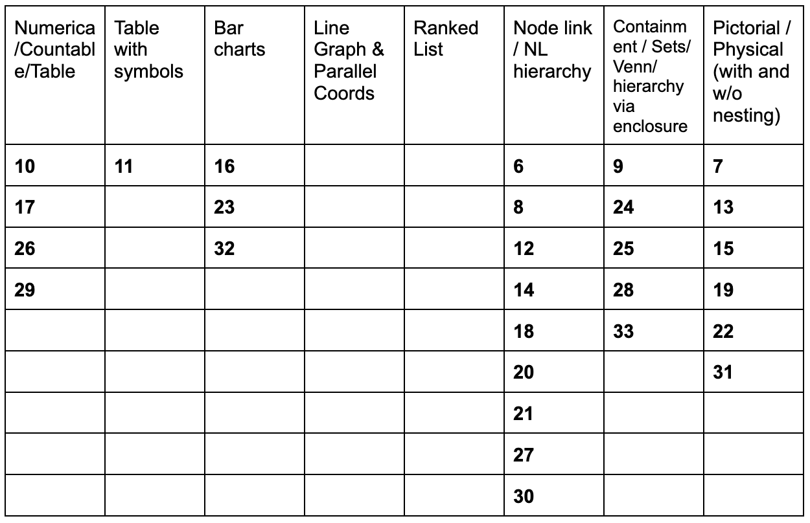
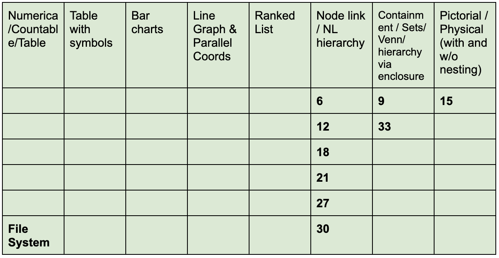
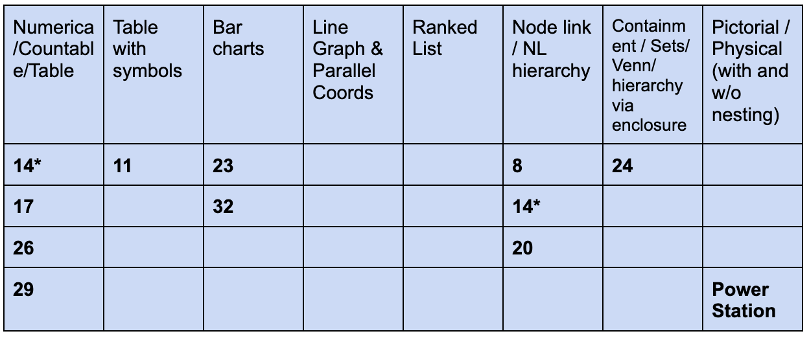
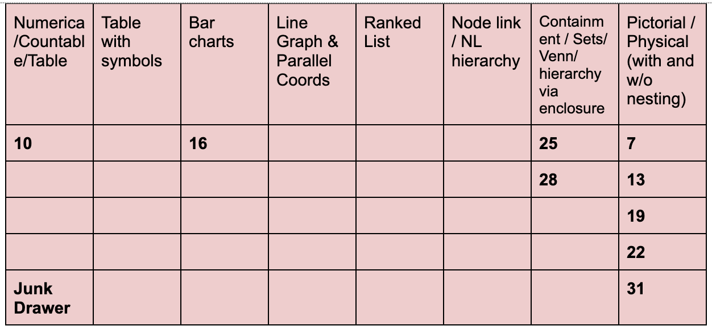

Formatting conventions
======================

## Themes are written as first-level headers
  - Codes are written as next level, subcodes as following level
  - Evidence is listed as bullet points.

Themes & Codes
==============

## Mental Models

These codes describe observations about mental models and their formation.

### MM1. There was a diversity of both typology-level data abstractions and idiom choices.
  - It is hard to completely disassociate the typology from the idiom, this is
    best effort based on both the produced drawing and the way the participant spoke about the drawing and their mental model
  - File System:
    - Hierarchies:
      - Node-link hierarchy
        - [Session 006](https://osf.io/kj4nt/)
        - [Session 021](https://osf.io/5hsua/)
        - [Session 021](https://osf.io/wdr2y/) (second drawing)
      - Nested hierarchy via enclosure
        - [Session 018](https://osf.io/q4ybw/) (second drawing)
    - Hierarchy/Set:
        - [Session 018](https://osf.io/mj84a/)
    - Hierarchy/Tree:
        - [Session 027](https://osf.io/mjen8/) (mostly node-link, but whole
          dataset with containment)
    - Hierarchy/Network:
      - Node-Link:
        - [Session 030](https://osf.io/2xvz4/)
    - Tree/Network:
      - Node-Link:
        - [Session 012](https://osf.io/4aphc/)
    - "Folder Structure":
      - Nested w/Links:
        - [Session 009](https://osf.io/6n7pa/)
    - Physical/Nested:
      - [Session 015](https://osf.io/y487f/)
    - List:
      - Stacked bar chart:
        - [Session 009](https://osf.io/6n7pa/) (second drawing)
    - Table/Newtork: 
      - Database tables:
        - [Session 030](https://osf.io/s7t2r/) (second drawing)
    - Nested:
      - [Session 033](https://osf.io/du6mw/) (interaction drawn)
  - Power Stations:
    - Tables:
      - [Session 011](https://osf.io/kaemj/)
      - [Session 017](https://osf.io/rqxab/)
      - [Session 026](https://osf.io/mpncx/)
      - [Session 029](https://osf.io/u7d5m/)
    - Set/Geospatial:
      - [Session 024](https://osf.io/d8pke/) (second drawing, but also
        discussed as abstracted from original)
    - Bar chart:
      - Per building type:
        - [Session 023](https://osf.io/prtw4/)
      - Per station, faceted by building type:
        - [Session 032](https://osf.io/y8z4r/) (drawn)
    - Network: 
      - Node-link:
        - [Session 008](https://osf.io/47sng/)
        - [Session 020](https://osf.io/wrd6x/)
    - Set:
        - [Session 024](https://osf.io/8hsv9/) (though geospatial discussed)
    - Network/Hierarchy/Table:
      - Table and Node-link
        - [Session 014](https://osf.io/dm3ak/)
    - Journal paper context with multiple figures, captions, and text:
      - [Session 032](https://osf.io/bka6e/) (spoken)
  - Junk Drawer:
    - Physical:
      - With nesting:
        - [Session 022](https://osf.io/ty2k8/)
      - No nesting:
        - [Session 019](https://osf.io/d2wgk/)
        - [Session 031](https://osf.io/akfv4/)
    - Physical/Set:
      - With nesting:
        - [Session 007](https://osf.io/hsy7q/)
        - [Session 013](https://osf.io/dgzrs/)
    - Bar chart
      - [Session 016](https://osf.io/4reuj/)
    - List
      - [Session 016](https://osf.io/u5dge/) (second drawing)
    - Key-value, Data format:
      - JSON: [Session 10](https://osf.io/kgv76/)
    - Hierarchy: 
      - [Session 10](https://osf.io/kgv76/) (second drawing)
    - Sets:
      - Venn diagram/text (Nested):
        - [Session 025](https://osf.io/ejqnr/)
      - Partitioned space:
        - [Session 028](https://osf.io/davzy/)

### MM2. Mental models started forming immediately.
  - Our first question asked about initial impressions/reactions. In this
    question, people already expressed ideas, including facets we found such as ordering and purpose-speaking.
    - Expressing ideas of what they would go on to draw:
      - [Session 006](https://osf.io/pkqsm/)
      - [Session 007](https://osf.io/kxze2/)
      - [Session 008](https://osf.io/wb4r5/) 
      - [Session 009](https://osf.io/es7w6/)
      - [Session 015](https://osf.io/zn6qj/)
      - [Session 018](https://osf.io/ydnb9/)
      - [Session 021](https://osf.io/v4nmf/)
      - [Session 024](https://osf.io/742fb/) - "My gut reaction was like an image of - I dunno if you know cell-free MIMO graphs..."
      - [Session 025](https://osf.io/z7w25/)
      - [Session 026](https://osf.io/wfrc5/)
      - [Session 030](https://osf.io/9jxy3/)
    - Expressing purpose-seeking:
      - [Session 008](https://osf.io/wb4r5/)
      - [Session 011](https://osf.io/qj2pm/)
      - [Session 013](https://osf.io/bgeh9/) - "I'm pretty sure it's like a
        handy tool box for a home..."
      - [Session 014](https://osf.io/gzw56/)
      - [Session 016](https://osf.io/d4efp/)
      - [Session 017](https://osf.io/qmts9/)
      - [Session 019](https://osf.io/z3j9f/)
      - [Session 020](https://osf.io/5rsjc/)
      - [Session 022](https://osf.io/psv9g/) - "So I have to. So it's usually used in an office space. So I think yeah, that’s it, not much of any intuition."
        - Does this person think "intuition" is tied to problem solving? May
          be a limitation.
      - [Session 029](https://osf.io/bph2d/) 
      - [Session 031](https://osf.io/cy3s4/) - "I thought it was going to be an algebra problem."
    - Expressing organization/desire to organize:
      - [Session 012](https://osf.io/xbw3h/) - "I don't think this is the most
        efficient way to do this."
      - [Session 014](https://osf.io/gzw56/) - "Ok, so like the data points, for example, number of homes, number of residents, that’s not important, it’s important how I organize it. Okay."
      - [Session 023](https://osf.io/t45ry/) - "Well, um there’s a lot of different categories, I guess."
      - [Session 026](https://osf.io/wfrc5/) - "I wanted to make it tidy."
      - [Session 028](https://osf.io/4u63n/) - "But as I read through it, I began to sort of group them into 4 groups."
  - When asked if the mental model changed, many said outright it did not.
      - Did not change: 
   	  - [Session 006](https://osf.io/pkqsm/)
	  - [Session 007](https://osf.io/kxze2/)
	  - [Session 008](https://osf.io/wb4r5/) - "I just stick to whatever I thought at the beginning."
          - [Session 009](https://osf.io/es7w6/) - Not really, I was pretty comfortable with this. I considered the fact of the size, but in my opinion that would be a different model and not necessarily the one that was initially asked for. So I’m staying pretty comfortable with this."
	  - [Session 014](https://osf.io/gzw56/)
	  - [Session 015](https://osf.io/zn6qj/)
	  - [Session 017](https://osf.io/qmts9/)
	  - [Session 018](https://osf.io/ydnb9/) - "No, I mean I kind of saw it for how I was gonna do it right away and stuck with that."
	  - [Session 019](https://osf.io/z3j9f/) - " Only in the sense that pens, sharpies, and pencils look alike, so I had to do something to distinguish them, but not really organizationally. "
	  - [Session 021](https://osf.io/v4nmf/) - "No it didn’t. From the time I first read it to when I drew it, it didn’t change."
	  - [Session 022](https://osf.io/psv9g/) - "No, my mental model didn’t change throughout the drawing process."
	  - [Session 024](https://osf.io/742fb/)
	  - [Session 025](https://osf.io/z7w25/)
	  - [Session 026](https://osf.io/wfrc5/) - " I don’t think so. I think I kind of just had in mind already, when I was trying to order it, what I was going to do in a matrix and so I know I was goingto create a matrix."
	  - [Session 027](https://osf.io/q9cn5/) - " No I think, after I had the thought of where the last folder being mentioned is, then I had the mental picture and after that I’d feel it was consistent, I’d say."
	  - [Session 028](https://osf.io/4u63n/)
	  - [Session 029](https://osf.io/bph2d/)
      - Became more refined in drawing, see: `MM-4: Mental model fixed at high level, but becomes more detailed in drawing`
      - Small change while talking:
          - [Session 012](https://osf.io/xbw3h/) - "During the conversation it’s been adjusting a little bit and what might be more proper for it, but overall it basically stayed the same idea."`
  - Several mentioned that aspects of their mental model were obvious
      - [Session 009](https://osf.io/es7w6/) - "It's obviously a folder structure."
      - [Session 016](https://osf.io/d4efp/) - "You know, obviously, as graphically, with the bars, but with the description, that just helped me in my brain categorizing it better"
      - [Session 032](https://osf.io/bka6e/) - "But I feel like in my head it’s the simplest conclusion."
      - [Session 033](https://osf.io/uj34p/) - "Yeah so obviously the text files are the ones with the two squigglys."
  - Significant mental model changes happened when participants sought a better Representation
     - [Session 010](https://osf.io/kgv76/) - Participant considers "web format" after initial JSON format
       - This session had microphone issues, so it's unclear at what point the model changed and/or if this was prompted by the question wording
     - [Session 016](https://osf.io/d4efp/) - Participant considers better ways to display during task
     - [Session 023](https://osf.io/t45ry/) - "I think so because when I read it, it made a lot of sense, but then I was trying to find the best way to express that data. Because I didn’t really know how to express it concisely where it makes a lot of sense. Because I felt like I just had a lot going on."
       - Note, this is one of the people with less data/vis familiarity
     - [Session 032](https://osf.io/bka6e/) - "Yeah I think it did change. I couldn’t think of a better way to represent it, given everything"
       - Note, this participant drew a bar graph but described a multi-reprensentation in a journal paper

### MM3. There is ambiguity among trees, hierarchies, sets, and their common visual idioms.
  - It was difficult to determine if the participant's mental model was what
    common dataset typologies would categorize as a tree versus a hierarchy versus a set. This may suggest a continuum. It may also suggest extra care be taken when dealing with any of these. This might suggest something about data that has relations in general.
  - We are trying best-effort categorization, but the difficulty in doing this supports the code:
    - Hierarchy as Node-Link:
	- [Session 006](https://osf.io/pkqsm/) - describes folders using the word
	  "level", draws node-link tree
	  - "Under that I kind of, in my head, picture text files just on an upper level, as being a little square with some writing on it or something."
	  - "So I’m mentally, in that first sentence (draws upper level), considering the most upper-level folder, and my brain is just picturing a window with these two in them. "
    - Hierarchy evolves into Network as Indented Tree/List or Database Tables or "entity
      relationship diagram":
      - [Session 030](https://osf.io/9jxy3/) - uses "hierarchy" and "levels"
        for first drawing then starts talking about "normal relationship", "properties"," ownership" and "membership" for the database tables
        - "I wouldn’t design, for example, if this is for an application and I had top-level code, I wouldn’t have a parallel folder that didn’t have code in it. This would be somewhere under this hierarchy (pointing to the right folder and subfolder) and referenced by whatever program was in here"
        - "youspend a good bit of time kind of clicking from one folder to another, going up,going down, the hierarchy ladder of the stuff."
        - "The other thing that comes to mind, if I were to try to map this out in some sort of normal relationship, then I might think of having a folders table, a files table, and the file table that has the property that tells what type of fileit is, and then I have an ownership or membership table that says, “this is inside that, and that, like that” (gesturing in space with flat hands)."
        - "I might call that an entity relationship diagram."
          - This has now evolved into a network
    - Tree/Graph as Node-Link:
        - [Session 012](https://osf.io/xbw3h/) - uses the word "branches", draws
          node-link tree but then adds relations between leaves
          - "Text files and code are on their separate branches and branches after that to represent how much they have, four and two respectively."
          - "nd then the other folder, there’s another folder symbol which leads to another text file and image branch, with one line each."
    - Tree & Hierarchy as Node-Link:
	- [Session 027](https://osf.io/q9cn5/)
          - "Um, I think it’s just whenever we speak of hierarchy in any terms, a tree is what comes to mind so that’s where my head first went, to show the hierarchy out."
    - Sets as Nesting and Proximity Association:
        - [Session 007](https://osf.io/kxze2/) - uses word "associations",
          draws physical with some items nested in others
          - " And a roll of stamps next to the envelope because... I guess that’s like logically associated with each other to put them in the same, like a postage basket."
        - [Session 013](https://osf.io/bgeh9/) - talks about pairing things
          (sometimes more than 2) and draws physical with some items nested in others
           - "you can pair rubber bands and tacks, you can pair envelopes and stamps, you can even pair pencils, pens, sharpener, pencil pouch, and a long basket to keep everything in it"
        - [Session 025](https://osf.io/z7w25/) - talks about enclosing circle
          and writing similar things near each other
          - " I thought it was going to be more similar objects, similar in size, similar in type. And then I drew a circle in my head around all of them."
          - "Pens, pencils, sharpies kind of, not in a group, but close to each other, because my mind unconsciously grouped them, maybe, possibly."
          - "so I just saw pens and then under it, I wrote “pencils” and “sharpies” because I was like, hey they’re close, so I made them a bit closer."
          - "You know, throughout my life, you just come across these diagrams, Venn diagrams."
    - Sets or Hierarchies as Node-Link or Nested
      - [Session 018](https://osf.io/ydnb9/) - users terms "set" but also
        "level" and "nesting" draws a node-link initially but said they considered a nested drawing (bonus)
        - "I have two outer sets that - so I decided to call them A and B."
        - "F1 -- that’s where I had to make a decision. It’s at a different level so should it be FC?"
        - "That the nesting matters so if I refer to something,"
        - "Yeah... so I do code during the day for my job, but I do front end stuff, so if I for example, have a json data file, if I want to refer to something a layer deeper a layer deeper, then I “.rate.mortgage” dot-whatever, so that’s kind of the way I thought about this."
        - (while drawing nested bonus image) "Yeah I think... I mean I think it would’ve probably just been the same thing, well I dunno how same it is but we’ll see... (drawing) So that would’ve been like my first. (Holds up paper with a rectangle representing a folder and smaller labeled, rectangles inside)."
      - [Session 021](https://osf.io/v4nmf/) - uses "buckets" and
        "underneath", draws indented tree first, node-link second.. with the second, participant uses language like 'hierarchy', 'contains' and 'includes'
        - "When you said I had two folders, I basically created two buckets withthese boxes. Underneath each box I listed what was included in those folders."
        - "To me they’re buckets. I kind of think of a folder as “oh here, here’s a bucket and here’s what’s in the bucket."
        - (second drawing) "So I did label the folders and explicitly labeled here's the first folder, and here's the second folder, and here's what isincluded in this folder and I grouped them together, with arrows to say this folder contains this group of things, and these things are text or image files, and then this folder includes this set of things, which also includes another folder, and that folder includes this set of things, so I kind of wanted to show visually that Folder 1 is kind of like a container that included, you know five things, whereas Folder 2 was a container that contains seven things with one of them actually containing two more things, so I was kind of showing that hierarchy, a little bit and and trying to help visualize these things as being together in a group, by boxing them around."
    - Network as Node-Link / Physical:
       - [Session 008](https://osf.io/wb4r5/) - uses word "connections" but
         also "wires", draws network
         - "Initially I was just picturing in my mind an actual power station that is connected to another building, or something. "
         - "These represent wires."
    - Network as Node-Link:
       - [Session 020](https://osf.io/5rsjc/) - uses "node", "connect",
         "graph" and  draws node-link
         - " I made each power station a separate node and then connected the nodes because I’m presuming they can connect the power stations."
         - "And then off each power station node, if it was residential I indicated that by an arrow that would indicate the number of residential spots."
         - "A graph basically."
         - "No, I haven’t seen a data set like that before, but this kind of graphing is kind of the way we think about problems and what we do at work.It tends to be kind of the default model I use for mathematical problems. I’ll always make it a graph problem, or frequently will. "
    - "Folder Structure" as Enclosure/Nesting with Links (Hybrid):
       - [Session 009](https://osf.io/es7w6/) - uses "inside"/"outside" to describe,
         draws nesting. Claims this is a "folder structure" repeatedly. Never says "tree"
    - Abstraction unclear as containment/enclosure:
      - [Session 033](https://osf.io/uj34p/) - uses "folder" and "subfolder",
        draws containment
         - "there’s one nested folder"
         - "And for the folder that is inthe other folder, for the little like -- I don’t know how to describe that, I guess I have a little blow-up image of what is in the sub-folder."
    - Sets and Geospatial Areas as Enclosure:
      - [Session 024](https://osf.io/742fb/) - talks of concentric circles,
        eventually overlapping with the geospatial version
        - "My gut reaction was like an image of - I dunno if you know cell-free MIMO graphs, but in this case, not-cell free MIMO, basically concentric circles of each power station."
        - " Each letter has a bubble that can contain squares, rectangles er horizontal rectangles or vertical with little squares inside them."
    - Relations & Network & Hierarchy & Map as Node-Link:
      - [Session 014](https://osf.io/gzw56/) - at a high level, participant
        talks about how elements of the data are related and draws a node link diagram, but no direct language is used. Uses this as "basis" to show connections next to a table. Later uses "endpoint" language for the power -- more network like. Even later uses "layers" like a hierarchy. Let the "mind map" comes up as the impetus, so this may be all "map" with terms like concept and sub-concept (hierarchy) and "links"
        - "And then we have warehouses, homes, and apartments (gestures to each respective node in the graph), so this is kind of the basis (gestures to entire graph)."
        - "what I would initially start with is the number of endpoints, like for instance, here warehouses and homes are endpoints because we are considering that as one unit. Whereas if we consider apartments, apartments will have number of residents, each resident will be an endpoint."
		- "Particularly the layers it has, for instance now, as I said, there are multiple parameters. There were three parameters for each warehouse (EDIT: I think he means power plant), which were its customers, and then there were sublayers to that as well. For example, apartments and how each each apartment housed a certain number of residents. So the layers of the data... the layers each data type has is what intrigued me"
        	- "I’m also used to using the mind map techniques, so first laying out everything on paper and then seeing theproblem statement and connecting different parts of the problem."
       		- "Breaking down a particular problem or a particular concept into its sub-concepts and representing it on papers. And representing in such a way that it’s easier to link back onto to the main concepts."
    - Physical nesting:
      - It's unclear from these that the relations were considered explicit.
        This is anti-examples where something we could consider a hierarchy or set was shown but language was not used to indicate it other than describing the physical depiction with "in"
      - [Session 015](https://osf.io/zn6qj/) - drew nested manila folders,
        used nesting language
        - This person has familiarity with trees and digraphs from school, but
          did not seem to associate this prompt with either
      - [Session 022](https://osf.io/psv9g/) 
        - "First I’ve taken the long plastic basket and I’ve tried to incorporate all the items into the basket as well as 4 pens and 2 pencils in a pencil pouch and keep all the things into the long basket. So it’s organized in a way and you can carry it around. "

    - Sets as Proximity, no nesting: 
       - [Session 016](https://osf.io/d4efp/) - discusses 'categories' but
         mostly talks of item types rahter than higher level grouping, in second drawing uses proximity to divide durable from expendable
       - [Session 028](https://osf.io/4u63n/) - drew 2 x 2 lists of items that
         they believed grouped together

### MM4. Mental models could become more detailed in drawing.
  - This code cross-references with MM2.
  - Revised during drawing:
     - [Session 006](https://osf.io/pkqsm/) - root added during discussion
     - [Session 011](https://osf.io/qj2pm/) _ participant considers what each building means in more detail
     - [Session 015](https://osf.io/zn6qj/) - rearrangement needed during
       drawing process
     - [Session 025](https://osf.io/z7w25/) - while drawing, participant comes
       up with new grouping for writing implements
     - [Session 026](https://osf.io/wfrc5/) - revised consideration of
       building types with more information
  - Becomes more detailed in drawing:
     - [Session 013](https://osf.io/bgeh9/) - "In the beginning I was just thinking about the basket and thenI started to remember how things were more clearly, so I started drawing slightly more elaborately and really thinking about what I wanted to draw."
     - [Session 020](https://osf.io/5rsjc/) - considers how it would scale
       to 100 buildings during process
     - [Session 025](https://osf.io/z7w25/) - while drawing, participant comes
       up with new grouping for writing implements
     - [Session 030](https://osf.io/9jxy3/) - "The minor hiccup was, obviously, trying to choose tokens to represent the category of files: text, image, code."
     - [Session 031](https://osf.io/cy3s4/) - item details considered during
       drawing to clarify depiction
     - [Session 033](https://osf.io/uj34p/) - icon detail/symbol choices not
       thought about until drawing

### MM5. Affordances can be part of the mental model.
  - File System:
      - [Session 006](https://osf.io/pkqsm/) - describes mental model as subset of
	of given data as they navigate it, similar to Windows
      - [Session 012](https://osf.io/xbw3h/) - drawing notes interaction,
	discussion mentions the drawing cannot be interactive
      - [Session 021](https://osf.io/v4nmf/) - participant describes drawing for
	others as recreating idea of what interactions would be in place
      - [Session 030](https://osf.io/9jxy3/) - when asked about idea, they talk
	about the interactions to navigate the hierarchy
      - [Session 033](https://osf.io/uj34p/) - inset to show nested folder
        confirmed to include interaction
  - Junk Drawer
    - [Session 022](https://osf.io/psv9g/) - basket drawn for carrying

### MM6. Physical objects can be used to represent data.
  - This code cross-references mental models, depictions, AND what-is-data,
    but as these were what the participant thought of, we placed it here as the main one.
  - Their organization (e.g. orientation, appearance, affordances) is based on the real world

    - Appearance: based on / tied to memories
      - [Session 008](https://osf.io/47sng/): the cooling towers 
      - [Session 013](https://osf.io/dgzrs/): the pencils, etc. 

    - Affordances: 
      - [Session 015](https://osf.io/y487f/): “physical” folder, issue of running out of space, words about putting things into the folder and it becoming out of shape: "Having a folder inside a folder, I guess. So that would - I guess since I’m imagining it physically, it would be cumbersome to have a folder inside a folder."

### MM7. Many participants could explicitly-state origins of their mental models.

  - Participants used file system icons or structures that they cited as being from an operating system/software
    - [Session 006](https://osf.io/kj4nt/)
    - [Session 009](https://osf.io/6n7pa/)
    - [Session 012](https://osf.io/4aphc/)
    - [Session 015](https://osf.io/y487f/)
    - [Session 021](https://osf.io/v4nmf/)
    - [Session 026](https://osf.io/wfrc5/)
    - [Session 029](https://osf.io/bph2d/)
    - [Session 030](https://osf.io/9jxy3/)
    
  - Participants cited a real-life example (e.g. a drawer they've seen, power plants, cell-free MIMO)
    - [Session 007](https://osf.io/kxze2/)
    - [Session 008](https://osf.io/wb4r5/)
    - [Session 013](https://osf.io/kxze2/)
    - [Session 019](https://osf.io/z3j9f/)
    - [Session 024](https://osf.io/742fb/)
    - [Session 025](https://osf.io/z7w25/)

  - Participant cited their work as the reason for the choice of data abstraction.
    - [Session 016](https://osf.io/d4efp/)
    - [Session 020](https://osf.io/5rsjc/)
    - [Session 029](https://osf.io/bph2d/)
    - [Session 032](https://osf.io/bka6e/)

### MM8. Participants with less math literacy had difficulty with their mental model.
  - [Session 023](https://osf.io/t45ry/) - participant has difficulty with
    multidimensional aspect of power station data, drops the power station dimension
  - [Session 031](https://osf.io/cy3s4/) - drew items as a list as given
  - Both are NC (non-computing professionals)

### Ordering & Grouping

These codes suggest how ordering arises in the mental model

#### OG1. Ordering is diverse and often personal.
  - Expressed personal preference:
    - By category/type:
      - [Session 006](https://osf.io/pkqsm/) - expressed desire to re-organize
        folder contents to homogenize types
      - [Session 012](https://osf.io/xbw3h/) - expressed desire to re-organize
        folder contents to homogenize types
      - [Session 016](https://osf.io/d4efp/) - by desired category of
        "durability" based on personal experience
      - [Session 021](https://osf.io/v4nmf/) - expressed desire to re-organize
        folders contents to homogenize types, but suggested there may be a reasoning to the given organization that they cannot infer.
    - By quantitative attribute:
      - [Session 016](https://osf.io/d4efp/) - by desired attribute of
        "price" based on personal experience
    - By logical association:
      - [Session 007](https://osf.io/kxze2/) - mental model/organization based
        on own "junk drawer"
      - [Session 019](https://osf.io/z3j9f/) - did not do this, but on
        revision... "I would’ve put the pens and pencils and sharpies in the pencil pouch. The rubber bands and the tacks and the stamps in the small tray, and probably the envelopes in the big tray because I like to organize." 
  - Reasoning unclear:
    - By category/type:
      - [Session 017](https://osf.io/qmts9/) - by residential vs. commercial
    - By size:
      - [Session 019](https://osf.io/z3j9f/) - consider organizing by size,
        but did not do that, might have on revision if communicating to others
    - By function:
      - [Session 028](https://osf.io/4u63n/) - junk drawer items by function

#### OG2. Participants tend to draw things in order of reading.
  - Non-read order (4 participants): 007 (junk drawer), 014 (power station), 022 (junk drawer), 023 (power station)
  - Unclear order (2 participants, due to video issues): 013, 019
  - Read-order (22 participants): the remaining session numbers not listed above.
  - Often, but not always, this order reflects itself on the page
    - Support: File System and Power Station tend to be drawn in order of reading.
      - [Session 026](https://osf.io/mpncx/): intentionally gave the participant the power stations in non-alphabetical order. They drew a table, rows in alphabetical order, and then filled in the cells in read-order (not alphabetically).
      - [Session 029](https://osf.io/bph2d): similar process of writing the names of the power stations in alphabetical order but then filling in table in read order (non-alphabetical). 
    - Against: 2 junk drawer examples (007, 022) and 2 power station examples (014, 023). We see organization on the page that is not related to the read-order but instead related to grouping the physical objects or categorizing the type of power recipient 
      - [Session 016 Bonus](https://osf.io/u5dge/): this user came up with ways to arrange the data based on attributes that they added
   - Temporal aspect of hypothesis forming on data reading seems interesting. I wonder how far
     this has been pushed with respect to progressive visualizations.

### OG3. There was a diversity of groupings that participants used for the junk drawer.
  - We saw grouping by functionality (2), grouping by a participant-selected category (2), grouping only writing implements (2), list order (no grouping) (4)

  - Grouped by Functionality:
    - [Session 007](https://osf.io/hsy7q/): grouped by functionality, used containers
      - Envelopes + stamps + in long plastic basket
      - Rubber bands + tacks + in small basket
      - Pens + pencils + in pencil pouch
      - Sharpies (participant said they ran out of space in pencil pouch)
    - [Session 028](https://osf.io/davzy/): grouped by functionality
      - Rubber bands + tacks
      - Envelopes + stamps + ~~pens~~
      - Pens + pencils + sharpies
      - Pencil pouch + long plastic basket
      - Participant said, "I grouped them based on if they have similar functionality." 
  
  - Grouped by Participant-Selected Category:
    - [Session 013](https://osf.io/dgzrs/): grouped by personal history
      - Envelopes + stamps 
      - Rubber bands + tacks
      - Sharpies + pencils + in small basket
      - Pens + in pencil pouch
      - Long plastic basket
    - [Session 016-Bonus](https://osf.io/4reuj/):grouped by durability (not all items)
      - Rubber bands + tacks (both are expendable), long plastic basket + basket (both are durable)

  - Grouped Only Writing Implements:
    - [Session 022](https://osf.io/ty2k8/): grouped writing implements* (* = explicitly not sharpies)
      - Pens + pencils + in pencil pouch
      - Participant said, "The sharpies I've kept separate, because not usually in a pencil pouch, and three envelopes also separate."
      - All of the items are in the long plastic basket (looks like a bucket)
    - [Session 025](https://osf.io/ejqnr/): grouped writing implements
      - Pens + pencils + sharpies
      - Otherwise, somewhat list order, left to right
      
  - List Order (No Grouping):
    - [Session 010](https://osf.io/kgv76/): list order
      - Rubber bands + tacks + envelopes + roll of stamps + pencils + sharpies + small basket + pencil pouch + long plastic basket
      - Bonus drawing: Bin + rubber bands + pencils
    - [Session 016](https://osf.io/4reuj/): list order
      - List order (wrapping around at "small plastic basket")
      - Participant observed, "The way the description was presented, it looks like it’s generally going from the items that you have the most of to the least of...I define categories of anything larger than 1." 
    - [Session 019](https://osf.io/d2wgk/): list order
      - items drawn separately
      - Participant stated, "If I thought of it more I would've put [the pens, pencils, sharpies] _in_ the pencil pouch."
    - [Session 031](https://osf.io/akfv4/): list order
      - items drawn separately

## Purpose-Seeking

In these codes, participants infer a bigger picture or task.

### PS1. Participants often wanted to add additional data or information.
  - Request data attributes to each item:
    - File system
      - [Session 009](https://osf.io/6n7pa/) - file sizes 
    - Power Stations
      - [Session 014](https://osf.io/dm3ak/) - power required per building
      - [Session 017](https://osf.io/qmts9/) - number of people per house
      - [Session 029](https://osf.io/bph2d/) - number of people per house
        (possibly as average), geospatial coordinates of houses
      - [Session 032](https://osf.io/bka6e/) - number of people per house, wattage
    - Junk Drawer
      - [Session 016](https://osf.io/d4efp/) - item costs/price, durability
        vs. expendable

  - Add relationships between items:
    - File system
      - [Session 012](https://osf.io/4aphc/) - add relationships between files
      - [Session 030](https://osf.io/9jxy3/) - database IDs, code file types
    - Junk drawer
      - [Session 007](https://osf.io/hsy7q/)
      - [Session 013](https://osf.io/dgzrs/)

  - Adding names, naming system, or schema:
    - File System
      - [Session 018](https://osf.io/ydnb9/) - folder names, file IDs and
        naming schema
  
  - Observation by KI - Participants want to add a 'richness' to the data in lots of dimensions. This isn't their data so they want to put it into the context of what they know. However, different people suggest different attributes. People may only want different parts of a wide dataset.

### PS2. Participants suggest or assume tasks.
  - Participants want to discover ultima: For power plant, which one produces the most/least energy?   
      - Supported by:
	- [Session 011](https://osf.io/kaemj/)
	- [Session 014](https://osf.io/dm3ak/)
	- [Session 032](https://osf.io/bka6e/)
      - Not Supported:
	- [Session 008](https://osf.io/47sng/)
  - Take inventory
    - [Session 016](https://osf.io/d4efp/)
  - Cleaning
    - [Session 019](https://osf.io/z3j9f/) 
  - Carrying
    - [Session 022](https://osf.io/psv9g/) 
  - Determine affected people and/or buildings
    - [Session 029](https://osf.io/bph2d/)
  - Math problem
    - [Session 031](https://osf.io/cy3s4/)
  - Present for scientific publication
    - [Session 032](https://osf.io/bka6e/)

### PS3. Participants suggest a source that could have created the data.
  - [Session 007](https://osf.io/kxze2/) - stationary drawer
  - [Session 010](https://osf.io/kedv9/) - office supplies
  - [Session 013](https://osf.io/bgeh9/) - toolbox, electrician's toolbox
  - [Session 016](https://osf.io/d4efp/) - office supplies
  - [Session 017](https://osf.io/qmts9/) - municipal or power company guide
  - [Session 020](https://osf.io/5rsjc/) - comes from residential part of city
  - [Session 021](https://osf.io/v4nmf/) - relation suggested but unknown
  - [Session 022](https://osf.io/psv9g/) - office supplies
  - [Session 024](https://osf.io/742fb/) - comes from residentail neighborhood
  - [Session 028](https://osf.io/4u63n/) - office items, pre-sorted
  - [Session 030](https://osf.io/9jxy3/) - organization of some program
  - Make a story/context for the file system: 
    - [Session 006](https://osf.io/kj4nt/)
    - [Session 009](https://osf.io/6n7pa/)
    - [Session 012](https://osf.io/4aphc/)

## Depictions

These codes collect observations about the drawing of the mental model and
further embellishment.

### D1. Participants used abstractions in the depiction.
  - Voiced the abstraction from the beginning:
    - [Session 011](https://osf.io/qj2pm/) - drew boxes because drawing houses
      would be too difficult
    - [Session 014](https://osf.io/gzw56/) - sketches idea of table rather
      than full table
    - [Session 024](https://osf.io/742fb/ ) - geospatial would have been
      difficult to draw, so they chose an abstracted version to draw
  - Used abstraction as drawing continued:
    - [Session 008](https://osf.io/47sng/) - buildings were in 3D at first but
      then switched to 2D icons
    - [Session 009](https://osf.io/es7w6/) - originally text files labeled
      with "txt" but participant says they stop labeling because of laziness

### D2. Participants ran into constraints with their existing sketch.

  - People run out of space when drawing.

    - [Session 007](https://osf.io/kxze2/): adds sharpies outside of pencil pouch because "I didn't make the pouch big enough."

    - [Session 015](https://osf.io/zn6qj/): drew outline of open folder first and then drew smaller rectangles inside for the files, but ran out of space: "it's hard to draw this. I should've brought a pencil."

    - [Session 016](https://osf.io/d4efp/): ran out of space drawing bars left to right, "I had to skip back here (left) to fill out the rest of the space."

    - [Session 022](https://osf.io/psv9g/): would have "made the basket a little bigger."
   
  - For unique data elements, people had difficulty picking icons/encodings that "went with" their existing encoding scheme.
    - [Session 030](https://osf.io/9jxy3/): while drawing, "Code file um” (thought then wrote words). During discussion, "The minor hiccup was, obviously, trying to choose tokens to represent the category of files: text, image, code."
    - [Session 033](https://osf.io/uj34p/): "And now I have to figure what I want to do for the code files." 

### D3. Participants used text for clarity and understanding.
  - *Note: use of text was only noted if the participant noted that they used text.*
  - [Session 009](https://osf.io/es7w6/): calls the files ".java" so that "we can be more explicit."
  - [Session 016](https://osf.io/d4efp/): participant "modified some of the descriptions" to help "me process a bit better." Switched to "noun, adjective."
  - [Session 019](https://osf.io/z3j9f/): to communicate to another person, the participant said they would use lists
  - [Session 021](https://osf.io/v4nmf/): used file "abbreviation" based on "knowing what text files look like" and "makes sense to me." For the code files, didn't know what the code was, so "I just said 'two code'."
  - [Session 027](https://osf.io/q9cn5/): "feel that when I use icons, unless it’s mutually understood by both people, it might confuse; or even I might forget what the notation actually stood for... You can't go wrong with text, and it's not long either." 
  - [Session 030](https://osf.io/9jxy3/): used "common file extensions", but recognized they used a mix of "tokens" for the file types
  - [Session 029](https://osf.io/bph2d/): asterisk footnote for residents per apartment

### D4. Participants added details for clarity and understanding.
  - *Note: use of detail was only noted if the participant noted that they added detail on purpose.*
  - [Session 012](https://osf.io/xbw3h/): added labels and arrows to suggest hypotheses about the nature of the files and their relations.
  - [Session 015](https://osf.io/zn6qj/): added shading for clarity.
  - [Session 019](https://osf.io/z3j9f/): suggests adding more detail to distinguish pens, pencils, and sharpies.
  - [Session 020](https://osf.io/5rsjc/):suggests adding weights to directed arrows, "it would be an improvement."
  - [Session 023](https://osf.io/t45ry/): added a scale. In a revised version they would "include power station letters somehow."
  - [Session 031](https://osf.io/cy3s4/): wishes they added detail to help clarify what items were
  - Question: Do we add instances of all representations of objects/things that were more complicated than simple shapes?
    - E.g. [Session 024](https://osf.io/742fb/) used squares for houses and long rectangles with 3-4 "little squares inside them" for windows to represent apartments. Is this an example of adding detail for clarity? The participant mentioned this distinction and that the squares were added as windows to the apartments.
    - Verdict: No. This seems to be more related to drawing ability and desired look of the icons, rather than clarity for communication.

### D5. Drawing a legend was uncommon, but participants clarified mappings verbally.
  - [Session 006](https://osf.io/pkqsm/): verbally explains the icons for the types of files.
  - [Session 024](https://osf.io/742fb/): verbally explained that small squares represent homes.
  - [Session 032](https://osf.io/bka6e/): made a legend

### D6. Aggregative marks and eliding details
  - Instances where participants used discrete aggregative marks in conjunction with concrete examples
    - [Session 012](https://osf.io/4aphc/)
      - "I marked it with a bunch of question marks to the right because I don't have any idea what [this folder] was for; it's just there"
    - [Session 030](https://osf.io/9jxy3/)
  - Instances where participants used continuous aggregative marks, without concrete examples
    - [Session 009](https://osf.io/6n7pa/)
    - [Session 023](https://osf.io/t45ry/)

## Communication

These codes gather observations about the effect of communication on the
mental model or depictions.

### C1. Participants changed the depiction for communication
  - This code cross-references with depiction
  - Same general abstraction
      - [Session 006](https://osf.io/pkqsm/) - root added during discussion
      - [Session 009](https://osf.io/es7w6/) - colors added when talking with
	facilitator
      - [Session 021](https://osf.io/v4nmf/) - tree drawn left-right to
	communicate with others and attempt to add interaction indications
      - [Session 031](https://osf.io/cy3s4/) - item details considered during
	drawing to clarify depiction
  - Different data abstraction
      - [Session 026](https://osf.io/wfrc5/) - discusses various dataset
	abstractions depending on audience "quantitative literacy"
      - [Session 032](https://osf.io/bka6e/) - "better way" to represent,
        possibly add table, other figures, captions

  - Added annotations when communicating with the facilitator:
      - [Session 006](https://osf.io/kj4nt/): added encompassing circles/squares around the top-level folders and around the contents of folder 1 (the children).
      - [Session 014](https://osf.io/dm3ak/): added graph with root node 'A' at the bottom of the page when discussing how they would solve for the total power generated.
      - [Session 009](https://osf.io/6n7pa/): added color to the icons as they explained their sketch. Unclear if this was motivated by the discussion or if this was a continuation of their drawing.

  - Identified when the drawing alone wouldn't make sense to another person.
      - [Session 031](https://osf.io/cy3s4/): "between the pens and the pencils and the sharpies, you can’t really tell what they are. If I were to give it to somebody, they probably wouldn’t be able to tell -- to differentiate between those groups...I probably should have written 'envelopes' on them, or some type of -- you know, if somebody were to look at this, I don’t think they would know what I drew."

### C2. Participants used terminology in conflict with visualization community concepts for data abstractions.

  - Instances where participants drew a table, even though their description was very non-tabular
    - [Session 014](https://osf.io/dm3ak/)
  - Instances where participants drew something more like a node-link diagram, even though their description was more set-like
    - [Session 006](https://osf.io/kj4nt/)

### C3. The "Describe your sketch" prompt yielded a range in the level of description detail

  - The range of verbal description provided: individual data points --> individual icons --> relations of icons / positions of icons --> data abstraction

  - Did not describe the drawing (restated the dataset): 8, 14, 18, 27, 32

    - [Session 008](https://osf.io/wb4r5/) stated "I would probably explain it like the data set that you just gave me. There are 6 power plants (reads the data set for A and B)." Provided explanation of icons upon request.  
    - [Session 014](https://osf.io/gzw56/): described (participant-selected) purpose and content for the dataset, but did not list data items or aspects of their drawing until they pointed to the table, saying "this is how I would represent the data."
    - [Session 018](https://osf.io/ydnb9/): reads off all of the labels of the files
    - [Session 027](https://osf.io/q9cn5/): reads file names (sentence structure very nearly matches the provided dataset)
    - [Session 032](https://osf.io/bka6e/): did not describe the drawing or the data, simply said, "this is a representation of 6 power stations and each of the facilities they power... you can see what they all do in the legend." (The participant narrated extensively as they drew so it's possible they felt they didn't need to explain again)

  - Only gave a visual description (usually of the icons or marks used): 6, 7, 10, 11, 12, 13, 15, 19, 21, 22, 24, 25, 30, 31, 33

    - These ranged in detail; some participants named every type of mark, some got distracted midway.

  - Named a data abstraction or idiom: 9, 16, 17, 20, 23, 26, 28, 29

    - NOTE: they did not always correctly name the abstraction or idiom that they used
    - They also included verbal descriptions of the icons or markings they used, a "verbal key".

  

  - This could have implications for accessibility -- when writing alt text for graphs or when presenting to visually impaired audiences.

## Beliefs about Data

These codes gather pre-conceptions participants had about the concepts of data and data analysis.

### BD1. The idea that data relates to tables is prevalent. 

  - [Session 007](https://osf.io/kxze2/): 
    Me: "Did it surprise you that we called it a data set?" 

    S: I was expecting something more structured, maybe like a table or something. I guess I was expecting a table. Because that’s the most common form of storing data, like a spreadsheet or table, something like that. I guess this a valid data set, it’s got objects and quantities for those objects.  
  - [Session 014](https://osf.io/gzw56/): 
    N: "For instance, there was apartments, there was houses, there was homes, there were warehouses so the first thing I thought in my mind was how to arrange those in a table in order to get an idea of how much power each house or apartment would generate or require."
  - [Session 019](https://osf.io/z3j9f/): "I think of, like I didn’t work with Excel very much, so I don’t think of data sets, but when I heard the term data sets, I really thought about the analysts I worked with and Excel data, and I thought of big data sets and grouping people by demographics, that kind of thing. I refer to data sets and I was familiar with them but I never thought of stuff like this as a data set." (junk drawer data set)
  - [Session 030](https://osf.io/9jxy3/): [bonus image](https://osf.io/s7t2r/) 
    E: "The other thing that comes to mind, if I were to try to map this out in some sort of normal relationship, then I might think of having a folders table, a files table, and the file table..."

### BD2.5 Biases about data: data is part of captial-S Science.
  - [Session 032](https://osf.io/y8z4r/): included the dataset in a journal paper setting. Commented about adding figures and captions, and having space in the paper to explain.

### BD2. There was hesitation regarding whether the given dataset was truly data.

  - [Session 007](https://osf.io/kxze2/): Data sets have objects and quantities "I guess this is a valid data set, it's got objects and quantities for
    those objects"
    - In vis, we don't always assume there are attributes
  - [Session 010](https://osf.io/kedv9/): Thinks of something related to
    computers as associated with the word "data"
  - [Session 012](https://osf.io/xbw3h/): Whether they visualize data
    regularly depends what counts as data
  - [Session 014](https://osf.io/gzw56/): Dataset and data within are
    different ideas: "like the emphasis should be on the data set, not the data containing in it, right?"
  - [Session 019](https://osf.io/z3j9f/): Data analysis is grouping people by demographics: "I really thought about the analysts I worked with and Excel data, and I thought of big data sets and grouping people by demographics, that kind of thing."
  - [Session 027](https://osf.io/q9cn5/): Participant didn't think of
    folders/files given as data, but assumed data was what was contained inside those files

Comparison to Related Work
==========================

## Comparison to Findings in Walny et. al ["An Exploratory Study of Data Sketching for Visual Representation"](http://research.jagoda.ca/selected-work/data-sketches)

### Placing our sketches on Walny's continuum[^fn]

[^fn]: J. Walny, S. Huron, and S. Carpendale. An Exploratory Study of Data Sketching for Visual Representation. Computer Graphics Forum, 34(3):231–240, 2015. doi: 10.1111/cgf.12635

## All 3 Datasets (28 sketches)

## File System Sketches (9 sketches)

## Power Station Datasets (11 sketches)

## Junk Drawer Datasets (9 sketches)

### Relation between "Including Extrinsic Information" (E3)/"Statements with Analytic Potential" (F) and the representation continuum
  - This code relates to [Walny et. al's](http://research.jagoda.ca/assets/pubs/Walny2015-EuroVis.pdf) finding that "in our sample, the participants who submitted the most abstract sketches were among the participants whose data reports tended to be in categories E3 (including extrinsic information) and F (statements with analytic potential)."
  - I decided to not look for E3 statements because our question "How did you come up with this idea?" asks for participants to connect their sketch or the data to their own lives, thus asks tem to include extrinsic information
  - [Session 006](https://osf.io/pkqsm/): 
    - F "[the files]could have some correlation between them [to explain their placement]"
  - [Session 007](https://osf.io/kxze2/): 
    - F "This is a drawer and I visualized this was probably in some 
  sort of cabinet, so this would be the edge of the cabinet if the door was closed", "it’s something that someone will probably have in their drawer"
  - [Session 008](https://osf.io/wb4r5/):
    - F "I mean I don't know what their fuels are, I’m assuming they’re maybe coal-powered power plants."
  - [Session 009](https://osf.io/es7w6/):
    - F "I don’t know how big it is, at the end of the day, right, so the text file could be bigger...could be super big, could be smaller". Type F and not type D because they hypothesize about an attribute (file size) that is not included in the data set.
  - [Session 010](https://osf.io/kedv9/):
    - None, could be due to limitation of interview (muted, no talking, text only)
  - [Session 011](https://osf.io/qj2pm/):
    - D "Power station C might be one of the bigger ones, either that or B, even though they had smaller numbers almost"  
  - [Session 012](https://osf.io/xbw3h/): 
    - E "I don’t think is the most efficient way to do this...What I find a little odd is that there’s a folder next to the coding files."
    - F "And next to that, next to both of them, I put “likely related” because when you put a text file and an image together like that, typically they’re related in some capacity."
  - Session 013:
    - F "I’m pretty sure it’s like a handy tool box... maybe an electrician’s tool box." 
  - Session 014:
    - D < a whole discussion on their mind map and how they would reduce down to a base unit of consumption to estimate the total amount of power produced by each power station >
  - Session 015: 
    - Possibly E "I guess since I’m imagining it physically, it would be cumbersome to have a folder inside a folder."
  - Session 016:
    - F "maybe there’s a better way to accurately display - because it sounds like this is someone inventorying the items in a desk or an office - and it’s “ok, we can make a count of six rubber bands,” but this isn’t showing the dollar value, essentially, or how someone might quantify the dollar value."
  - Session 017: 
    - F "I dunno, it's a power station, it’s probably a municipal guide or a power company’s guide to how to distribute power."
  - Session 018:
    - D4/E2 "F1 -- that’s where I had to make a decision. It’s at a different level so should it be FC? I decided “no.” So I decided on F1 to stick with the program of that level."
  - Session 019: 
    - E2 "It seems like when I cleaned out my desk when I retired. Where are 
paperclips? (Laughing)"
  - Session 020:
    - F "Gut reaction huh? Hmm. It seems to mostly be a residential area. I see many homes listed, I only see a warehouse, so I would guess this is kind of a residential part of a town or a city."

